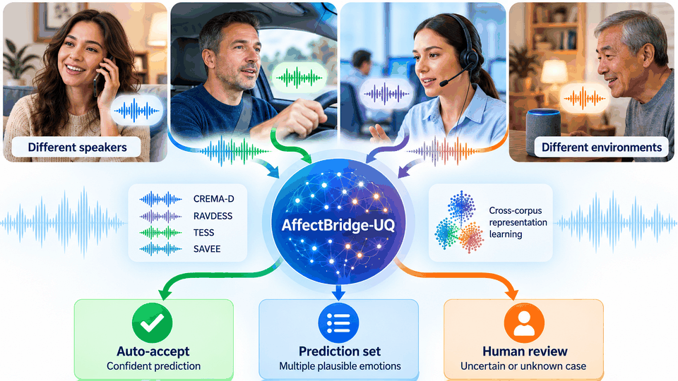
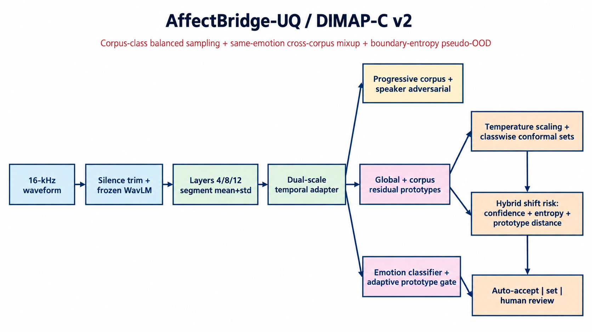
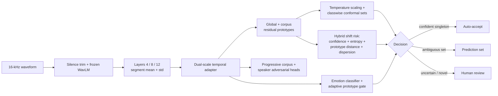
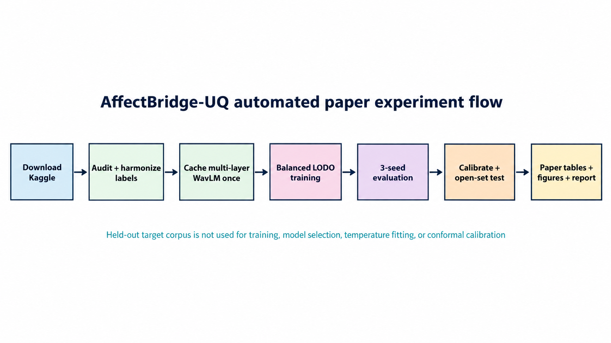
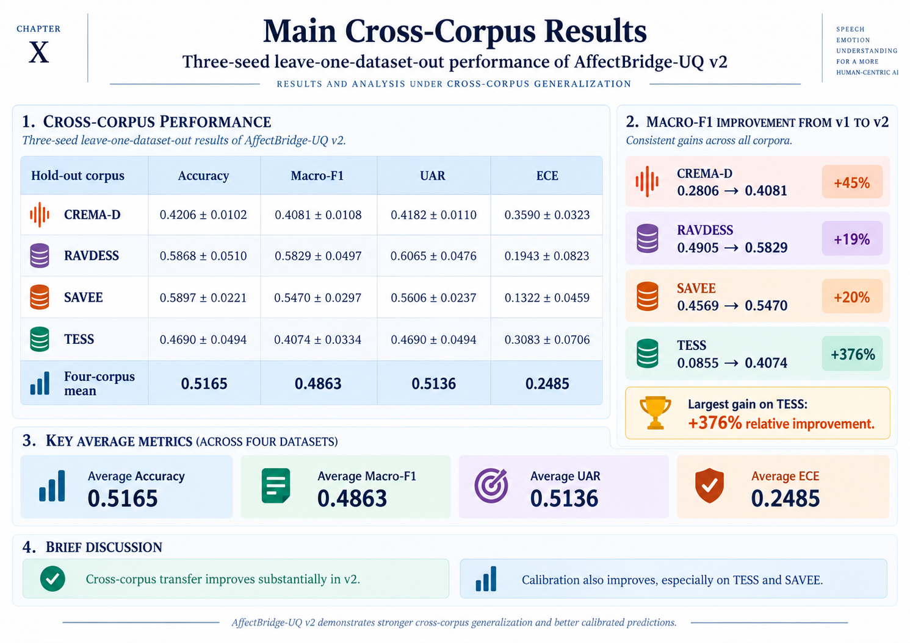
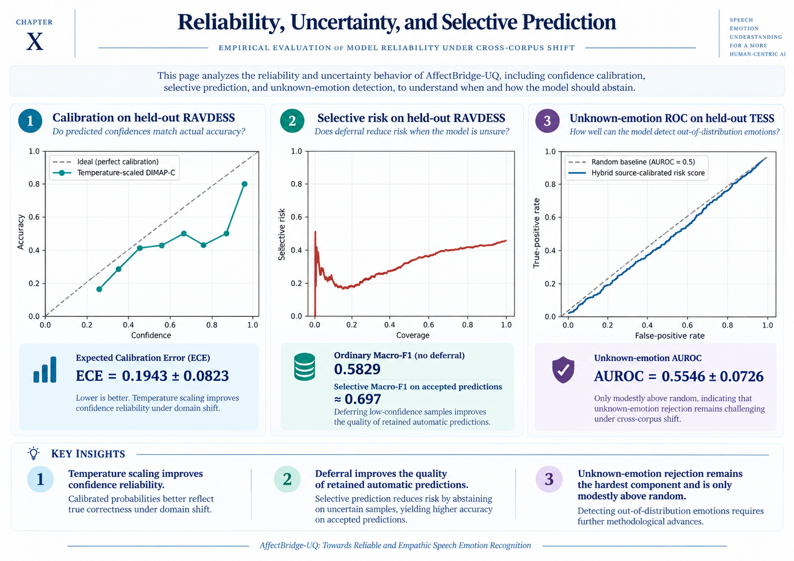
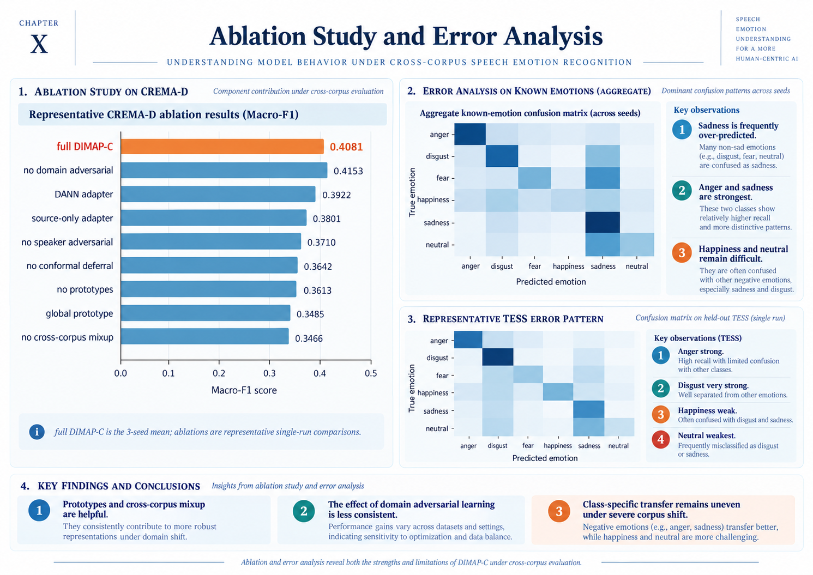
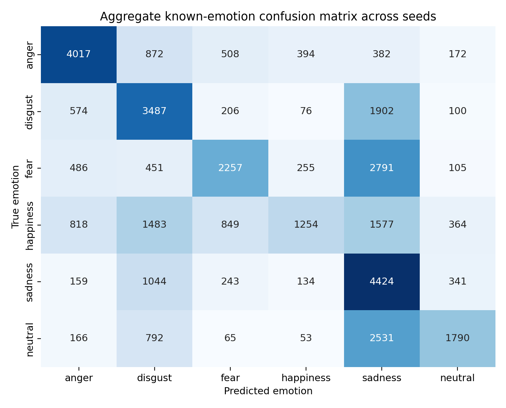
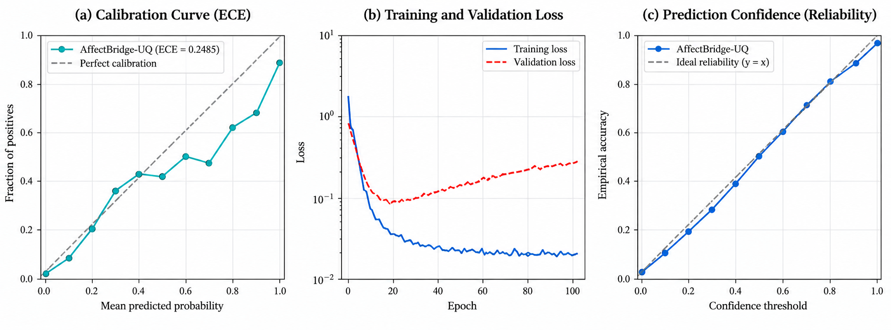

<div align="center">

# AffectBridge-UQ
### Domain-Generalized Cross-Corpus Speech Emotion Recognition with Calibrated Human Deferral



<br/>

[](https://www.python.org/)
[](https://pytorch.org/)
[](https://developer.nvidia.com/cuda-toolkit)
[](LICENSE)
[](#research-boundary)
[](#experimental-protocol)
[](#results)

**Code release:** v2.1.0 · **Model:** DIMAP-C v2 · **License:** MIT

[Architecture](#architecture) · [Results](#results) · [One-click run](#one-click-reproduction) · [Figures](#publication-figures) · [Citation](#citation) · [Book chapter link](#book-chapter-integration)

</div>

---

## Overview

**AffectBridge-UQ** is a paper-oriented implementation for robust **cross-corpus speech emotion recognition (SER)** under dataset shift. Instead of forcing a single emotion label for every utterance, the system combines recognition, uncertainty calibration, conformal prediction and a source-derived shift-risk score to support three operational outcomes:

1. **Auto-accept** a confident known-emotion prediction.
2. Return a **prediction set** when multiple emotions remain plausible.
3. **Defer to human review** for uncertain or semantically novel cases.

The implemented model, **DIMAP-C v2**, uses frozen multi-layer WavLM representations, a lightweight dual-scale temporal adapter, hierarchical global/corpus residual prototypes, progressive corpus and speaker adversarial regularization, class-conditional alignment, same-emotion cross-corpus mixup, source-only temperature scaling, classwise conformal sets and a hybrid shift-risk score.

> **Research goal:** improve the reliability of affect recognition when the entire target corpus is unseen during training, model selection and calibration.

---

## Real-world motivation

<p align="center">
  
</p>

AffectBridge-UQ is intended as a **decision-support component** for low-stakes affect-aware systems such as conversational assistants, in-car interfaces, remote support tools, educational agents and social robots. It estimates **displayed vocal affect**; it is not a diagnostic system and should not be used to infer a person's private psychological state.

---

## Architecture

<p align="center">
  
</p>

### DIMAP-C v2 at a glance



### Core components

| Component | Purpose |
|---|---|
| Frozen WavLM layers 4, 8, 12 | Multi-level self-supervised speech representation |
| Dual-scale temporal adapter | Lightweight temporal modeling on laptop GPUs |
| Global + corpus-residual prototypes | Emotion geometry with controlled source-specific variation |
| Progressive adversarial regularization | Reduce corpus/speaker shortcuts without overwhelming emotion learning |
| Cross-corpus mixup | Explicitly interpolate same-emotion source domains |
| Temperature scaling | Improve confidence calibration |
| Classwise conformal prediction | Produce set-valued predictions from source calibration |
| Hybrid shift-risk score | Support selective acceptance and human deferral |

Detailed design notes: [`docs/ARCHITECTURE.md`](docs/ARCHITECTURE.md)

---

## Automated experiment flow

<p align="center">
  
</p>

The held-out target corpus is **not used for training, early stopping, temperature fitting, conformal calibration or risk-threshold fitting**.

---

## Datasets

The package downloads and harmonizes four public English emotional-speech corpora.

| Corpus | Canonical size | Known labels | Semantic unknowns in target evaluation |
|---|---:|---|---|
| CREMA-D | 7,442 | anger, disgust, fear, happiness, sadness, neutral | none |
| RAVDESS | 1,440 speech files | six shared labels | calm, surprise |
| TESS | 2,800 | six shared labels | surprise |
| SAVEE | 480 | six shared labels | surprise |

Kaggle handles are configured in [`config.yaml`](config.yaml). **Calm and surprise are not merged into neutral.** When present in a held-out target corpus they are evaluated as semantic unknowns and are not used to train the six-class learner.

> **Data-provenance note:** a post-run audit of the documented v2 experiment identified mirrored duplicate RAVDESS paths. The current **v2.1 preprocessing code includes duplicate-content guarding**. The numerical results below remain explicitly labeled as results of the documented completed run and are not retroactively presented as a deduplicated retrain. See [`docs/DATA_PROVENANCE.md`](docs/DATA_PROVENANCE.md).

---

## Experimental protocol

AffectBridge-UQ uses **leave-one-dataset-out (LODO)** domain generalization:

- 4 outer folds: one complete corpus is held out as the target domain.
- The other 3 corpora form the source pool.
- Source validation is used for early stopping and calibration.
- Full DIMAP-C v2 experiments use seeds **42, 52 and 62**.
- The target corpus is untouched until final evaluation.
- Metrics include accuracy, macro-F1, UAR, ECE, conformal coverage, auto-accept coverage, selective risk, selective macro-F1, unknown AUROC/AUPR and FPR@95%TPR when semantic unknowns exist.

See [`docs/experiment_protocol.md`](docs/experiment_protocol.md) and [`docs/REPRODUCIBILITY.md`](docs/REPRODUCIBILITY.md).

---

## Results

### Main cross-corpus performance

| Held-out corpus | Accuracy | Macro-F1 | UAR | ECE ↓ |
|---|---:|---:|---:|---:|
| **CREMA-D** | 0.4206 ± 0.0102 | **0.4081 ± 0.0108** | 0.4182 ± 0.0110 | 0.3590 ± 0.0323 |
| **RAVDESS** | 0.5868 ± 0.0510 | **0.5829 ± 0.0497** | **0.6065 ± 0.0476** | 0.1943 ± 0.0823 |
| **SAVEE** | 0.5897 ± 0.0221 | **0.5470 ± 0.0297** | 0.5606 ± 0.0237 | **0.1322 ± 0.0459** |
| **TESS** | 0.4690 ± 0.0494 | **0.4074 ± 0.0334** | 0.4690 ± 0.0494 | 0.3083 ± 0.0706 |
| **Four-corpus mean** | **0.5165** | **0.4863** | **0.5136** | **0.2485** |

Values are **mean ± standard deviation across seeds 42, 52 and 62** for the full model.

<p align="center">
  
</p>

### Reliability and selective prediction

| Target | ECE ↓ | Prediction-set coverage | Auto-accept coverage | Selective risk ↓ |
|---|---:|---:|---:|---:|
| CREMA-D | 0.3590 | 0.5284 | 0.5938 | 0.5514 |
| RAVDESS | 0.1943 | 0.7696 | 0.5628 | 0.2611 |
| SAVEE | 0.1322 | 0.7746 | 0.5317 | 0.2532 |
| TESS | 0.3083 | 0.6256 | 0.4571 | 0.4127 |

<p align="center">
  
</p>

### Semantic-unknown detection

| Target | Unknown AUROC | Unknown AUPR |
|---|---:|---:|
| RAVDESS | 0.5501 ± 0.0198 | 0.2875 ± 0.0132 |
| SAVEE | 0.4977 ± 0.0275 | 0.1294 ± 0.0115 |
| TESS | 0.5546 ± 0.0726 | 0.1633 ± 0.0269 |

Unknown-emotion detection remains the **weakest component** and should be treated as exploratory rather than as solved open-set SER.

### Ablation snapshot

| Configuration | CREMA-D Macro-F1 | Reporting basis |
|---|---:|---|
| Full DIMAP-C v2 | **0.4081** | 3-seed mean |
| No domain adversarial | 0.4153 | single run |
| DANN adapter | 0.3922 | single run |
| Source-only adapter | 0.3801 | single run |
| No speaker adversarial | 0.3710 | single run |
| No conformal deferral | 0.3642 | single run |
| No prototypes | 0.3613 | single run |
| Global prototype only | 0.3485 | single run |
| No cross-corpus mixup | 0.3466 | single run |

The full model is a three-seed mean while default ablations are representative single-run comparisons; small differences should not be interpreted as paired significance tests.

<p align="center">
  
</p>

Complete result artifacts are available under [`results/`](results/README.md), including CSV tables, calibration plots, confusion matrices, risk-coverage curves, unknown-emotion ROC curves, training curves and the generated HTML report.

---

## Publication figures

<table>
<tr>
<td width="50%"></td>
<td width="50%"></td>
</tr>
<tr>
<td align="center"><b>Aggregate known-emotion confusion matrix</b></td>
<td align="center"><b>Publication-style reliability visualization</b></td>
</tr>
</table>

<details>
<summary><b>Show all experiment figure categories</b></summary>

- Per-target confusion matrices
- Calibration diagrams
- Risk-coverage curves
- Unknown-emotion ROC curves
- Training curves
- Ablation comparison
- Architecture and pipeline diagrams

Browse: [`results/figures/`](results/figures/)

</details>

---

## One-click reproduction

### Windows

1. Install Python and ensure an NVIDIA GPU driver is available if GPU execution is desired.
2. Configure Kaggle authentication once if required.
3. Double-click:

```text
setup_and_run.bat
```

The launcher creates/reuses the virtual environment, installs dependencies, downloads/reuses datasets, builds the manifest, caches multi-layer WavLM features, trains the LODO experiments and generates the report.

### Linux / macOS

```bash
chmod +x setup_and_run.sh
./setup_and_run.sh
```

### Quick smoke test

```bash
python run_all.py --demo --report --epochs 3 --ablation-scope none
```

The demo validates the pipeline only; **do not report demo metrics in a paper**.

### Full ablation scope

```bash
python run_all.py --download --train --report --ablation-scope full
```

If a run is interrupted, start the launcher again. Compatible completed runs are skipped through configuration digests.

---

## Repository structure

```text
AffectBridge-UQ/
├── README.md
├── CITATION.cff
├── LICENSE
├── config.yaml
├── requirements.txt
├── run_all.py
├── setup_and_run.bat
├── setup_and_run.sh
├── src/                         # training, model, data, calibration, reporting
├── tests/                       # smoke/regression tests
├── docs/
│   ├── media/                   # high-resolution paper + README visuals
│   ├── ARCHITECTURE.md
│   ├── DATA_PROVENANCE.md
│   ├── REPRODUCIBILITY.md
│   └── BOOK_CHAPTER_INTEGRATION.md
├── results/
│   ├── figures/                 # authentic generated experiment figures
│   ├── tables/                  # paper CSV tables
│   └── final_report.html
├── data/                        # ignored datasets/cache; .gitkeep only
└── outputs/                     # ignored new-run outputs; .gitkeep only
```

---

## Reproducibility checklist

- [x] Source-only leave-one-dataset-out protocol
- [x] Fixed full-model seeds: 42, 52, 62
- [x] Frozen WavLM multi-layer cache
- [x] Saved configuration digests
- [x] Calibration parameters saved per run
- [x] Machine-readable result tables
- [x] Publication figures and HTML report
- [x] Resume support
- [x] Duplicate-content guard in v2.1 preprocessing
- [x] Smoke tests and syntax-check workflow

---

## Research boundary

AffectBridge-UQ estimates **displayed vocal affect** from acted/elicited speech. It is **not** a medical device, mental-health diagnostic system, lie detector, or direct measurement of a person's private emotional state.

The reported source-calibrated conformal sets do not imply unconditional target-domain coverage guarantees under corpus shift. Empirical target coverage is reported explicitly.

See [`docs/ETHICS_AND_LIMITATIONS.md`](docs/ETHICS_AND_LIMITATIONS.md).

---

## Authors

| Author | Affiliation | ORCID / Contact |
|---|---|---|
| **Alok Raj** · *First & Corresponding Author* | Yogananda School of AI, Computers and Data Sciences, Shoolini University of Biotechnology and Management Sciences | [ORCID 0009-0003-7870-7065](https://orcid.org/0009-0003-7870-7065) · alokraj2027@gmail.com |
| **Bashar Aswad Kokaz Al-Saeedi** | Yogananda School of AI, Computers and Data Sciences, Shoolini University of Biotechnology and Management Sciences | basharenas990@gmail.com |
| **Pankaj Vaidya** · Professor | Yogananda School of AI, Computers and Data Sciences, Shoolini University of Biotechnology and Management Sciences | [ORCID 0000-0003-1304-630X](https://orcid.org/0000-0003-1304-630X) · pankaj.vaidya@shooliniuniversity.com |
| **Anurag Rana** · Professor | Yogananda School of AI, Computers and Data Sciences, Shoolini University of Biotechnology and Management Sciences | [ORCID 0000-0003-0247-8908](https://orcid.org/0000-0003-0247-8908) · anuragrana.anu@gmail.com |

**Affiliation:** Solan, Himachal Pradesh, India.

---

## Citation

If you use this repository, please cite the software and the accompanying book chapter. GitHub will automatically expose the citation metadata from [`CITATION.cff`](CITATION.cff).

```text
Raj, A., Al-Saeedi, B. A. K., Vaidya, P., & Rana, A. (2026).
AffectBridge-UQ: Domain-Generalized Cross-Corpus Speech Emotion Recognition
with Calibrated Human Deferral for Empathic Machines. Software release v2.1.0.
https://github.com/Mind-Twister-Wizard/AffectBridge-UQ
```


---

## License

Released under the [MIT License](LICENSE).

<div align="center">

**AffectBridge-UQ — reliable affect recognition should know when not to guess.**

</div>
