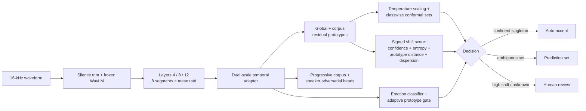

<div align="center">

# AffectBridge-UQ
### Uncertainty-Aware Domain-Generalized Cross-Corpus Speech Emotion Recognition with Selective Human-Review Deferral


<br/>

[](https://www.python.org/)
[](https://pytorch.org/)
[](https://developer.nvidia.com/cuda-toolkit)
[](LICENSE)
[](#research-boundary)
[](#experimental-protocol)
[](#documented-development-run-results)

**Code release:** v2.1.0 · **Model:** DIMAP-C v2 · **License:** MIT

[Architecture](#architecture) · [Protocol](#experimental-protocol) · [Results](#documented-development-run-results) · [Reproduction](#one-click-reproduction) · [Citation](#citation)

</div>

---

## Overview

**AffectBridge-UQ** is a source-only cross-corpus speech emotion recognition (SER) framework designed to expose uncertainty rather than force a single class prediction for every utterance. The implemented DIMAP-C v2 model combines frozen multi-layer WavLM features, a dual-scale temporal adapter, hierarchical global/corpus-residual emotion prototypes, progressive corpus and speaker regularization, source-only calibration, classwise conformal prediction, and a signed shift-risk score.

The system supports three decision outcomes:

1. **Auto-accept** a confident singleton prediction.
2. Return a **prediction set** when several emotions remain plausible.
3. **Defer to human review** when the conformal set is ambiguous or the source-derived shift score is high.

**Predictive uncertainty, distributional shift, and semantic novelty are related but distinct.** An in-distribution example may be uncertain, while a semantically novel example may still receive a high-confidence prediction. AffectBridge-UQ therefore treats calibration, shift-risk estimation, and semantic-unknown detection as complementary rather than interchangeable mechanisms.

> The model estimates **displayed vocal affect** from acted/elicited speech. It is not a diagnostic system and does not infer a person's private emotional state, intentions, sincerity, or mental-health status.

---

## Real-world motivation

<p align="center">
  
</p>

No live deployment or user study has been conducted. The three-way decision policy is presented as a **conceptual low-stakes interaction framework**, not as a validated operational workflow.

---

## Architecture

<p align="center">
  
</p>



### Manuscript-aligned design clarifications

- WavLM layers **4, 8, and 12** are used as lower-, middle-, and higher-level encoder snapshots. This is a design choice; no dedicated layer-selection ablation is claimed.
- Eight temporal segments are retained. For each selected WavLM layer, segment-wise mean and standard deviation of the 768-dimensional hidden state are concatenated, producing a **4,608-dimensional descriptor per segment**.
- Each emotion has a global prototype plus a bounded corpus-specific residual. Unlike local prototype SER approaches, the formulation explicitly decomposes each prototype into shared and corpus-residual components while jointly regularizing cross-corpus structure.
- The fixed global/local prototype blend is **0.55 / 0.45**. It is an engineering hyperparameter held constant across all folds and seeds; no sensitivity analysis is claimed.
- Domain and speaker adversarial losses use coefficients **0.04** and **0.015**. The progressive gradient-reversal schedule has a separate maximum coefficient of **0.15**.
- Same-emotion cross-corpus feature mixup uses `Beta(0.6,0.6)` rescaled to `[0.2,0.8]`; approximately 50% of eligible pairs are retained and the class label is preserved.
- Boundary pseudo-OOD mixing uses different-emotion, different-corpus pairs with `Beta(4,4)` rescaled to `[0.3,0.7]`; approximately 50% of eligible pairs are retained and optimized with `0.025 × KL(p || Uniform)`.
- The hybrid shift score is **signed**. Negative values are permitted and are not clipped; only ordering relative to the source-derived threshold is used.

Detailed equations and algorithmic definitions are in [`docs/ARCHITECTURE.md`](docs/ARCHITECTURE.md).

---

## Datasets and label protocol

| Corpus | Canonical size | Known classes | Semantic unknowns |
|---|---:|---:|---|
| CREMA-D | 7,442 | 6 | none |
| RAVDESS | 1,440 speech files | 6 | calm, surprise |
| TESS | 2,800 | 6 | **pleasant surprise** → protocol label `surprise` |
| SAVEE | 480 | 6 | surprise |

Known-label space: `anger, disgust, fear, happiness, sadness, neutral`.

TESS `ps` / `pleasant surprise` is explicitly parsed and normalized to the protocol label `surprise`; it is not silently renamed in the data parser. Full mappings are documented in [`docs/experiment_protocol.md`](docs/experiment_protocol.md).

### RAVDESS provenance

A post-run audit found that the documented v2 experiment manifest contained **2,880 RAVDESS rows representing two mirrored copies of the canonical 1,440 speech files**. Because the outer fold is corpus-level, the mirror copies did not cross the held-out target/source corpus boundary. However, when RAVDESS was a source corpus, identical files could have appeared in both source-training and source-validation partitions, reweighting optimization and potentially affecting model selection/calibration.

The current v2.1 manifest builder hashes audio content and removes exact within-corpus duplicates **before any split is constructed**. The archived numerical results below are retained as provenance of the documented development run and are **not** relabeled as deduplicated results. See [`docs/DATA_PROVENANCE.md`](docs/DATA_PROVENANCE.md).

---

## Experimental protocol

AffectBridge-UQ uses four-fold leave-one-dataset-out domain generalization. For each fold, one entire corpus is reserved as target test data and the other three form the source pool. Full-model experiments use seeds **42, 52, and 62**.

### Documented development run

- The held-out target corpus was excluded from training, early stopping, temperature fitting, conformal calibration, and risk-threshold fitting.
- Source validation was created separately within each source corpus.
- Speaker-grouped validation was used when feasible; TESS used a stratified utterance-level fallback because it contains only two speakers.
- The **same source-validation partition** was used for early stopping and post-hoc temperature/conformal calibration.

This avoids target leakage but couples model selection and calibration. The professor-reviewed manuscript therefore treats the current numbers as **documented development-run results**.

### Confirmatory protocol recommended for archival publication

A stronger rerun should use disjoint source partitions for:

1. optimization/training;
2. model-selection/early stopping;
3. temperature + conformal calibration;
4. untouched held-out corpus testing.

The confirmatory rerun should also use the duplicate-safe RAVDESS manifest, retain the same four folds and three seeds, report matched **pre- vs post-temperature-scaling ECE**, and preferably use paired multi-seed ablations.

See [`docs/experiment_protocol.md`](docs/experiment_protocol.md) and [`docs/REPRODUCIBILITY.md`](docs/REPRODUCIBILITY.md).

---

## Documented development-run results

> **Important:** these are the archived results from the documented pre-deduplication run with shared source validation for model selection and calibration. They are preserved for traceability and should not be interpreted as results of the corrected confirmatory protocol.

### Main cross-corpus performance

| Held-out corpus | Accuracy | Macro-F1 | UAR | ECE ↓ (post-scale) |
|---|---:|---:|---:|---:|
| CREMA-D | 0.4206 ± 0.0102 | **0.4081 ± 0.0108** | 0.4182 ± 0.0110 | 0.3590 ± 0.0323 |
| RAVDESS | 0.5868 ± 0.0510 | **0.5829 ± 0.0497** | **0.6065 ± 0.0476** | 0.1943 ± 0.0823 |
| SAVEE | 0.5897 ± 0.0221 | **0.5470 ± 0.0297** | 0.5606 ± 0.0237 | **0.1322 ± 0.0459** |
| TESS | 0.4690 ± 0.0494 | **0.4074 ± 0.0334** | 0.4690 ± 0.0494 | 0.3083 ± 0.0706 |
| **Four-corpus mean** | **0.5165** | **0.4863** | **0.5136** | **0.2485** |

All ECE values above are **post-temperature-scaling**. The archived run did not retain a matched pre-scaling ECE series, so this repository does **not** claim that temperature scaling numerically reduced ECE in the reported run.

<p align="center">
  
</p>

### Reliability and selective prediction

| Target | ECE ↓ (post-scale) | Prediction-set coverage | Auto-accept coverage | Selective risk ↓ |
|---|---:|---:|---:|---:|
| CREMA-D | 0.3590 | 0.5284 | 0.5938 | 0.5514 |
| RAVDESS | 0.1943 | 0.7696 | 0.5628 | 0.2611 |
| SAVEE | 0.1322 | 0.7746 | 0.5317 | 0.2532 |
| TESS | 0.3083 | 0.6256 | 0.4571 | 0.4127 |

### Semantic-unknown detection

| Target | Unknown AUROC | Unknown AUPR |
|---|---:|---:|
| RAVDESS | 0.5501 ± 0.0198 | 0.2875 ± 0.0132 |
| SAVEE | 0.4977 ± 0.0275 | 0.1294 ± 0.0115 |
| TESS | 0.5546 ± 0.0726 | 0.1633 ± 0.0269 |

Semantic-unknown detection is the weakest component and is treated as exploratory rather than solved open-set SER.

### Representative ablations

| Configuration | CREMA-D Macro-F1 | Reporting basis |
|---|---:|---|
| Full DIMAP-C v2 | 0.4081 | 3-seed mean |
| No domain adversarial | 0.4153 | single run |
| DANN adapter | 0.3922 | single run |
| Source-only adapter | 0.3801 | single run |
| No speaker adversarial | 0.3710 | single run |
| No conformal deferral | 0.3642 | single run |
| No prototypes | 0.3613 | single run |
| Global prototype only | 0.3485 | single run |
| No cross-corpus mixup | 0.3466 | single run |

These ablations use different single seeds and are **not paired significance tests**. In particular, the `no_domain_adversarial` run slightly exceeds the full-model three-seed mean, so the domain-adversarial term should not be described as uniformly beneficial.

Complete artifacts are available in [`results/`](results/README.md).

---

## Publication figures

<table>
<tr>
<td width="50%"></td>
<td width="50%"></td>
</tr>
<tr>
<td align="center"><b>Aggregate known-emotion confusion matrix</b></td>
<td align="center"><b>Reliability visualization</b></td>
</tr>
</table>

Browse all generated figures in [`results/figures/`](results/figures/).

---

## One-click reproduction

### Windows

```text
setup_and_run.bat
```

### Linux / macOS

```bash
chmod +x setup_and_run.sh
./setup_and_run.sh
```

### Smoke test

```bash
python run_all.py --demo --report --epochs 3 --ablation-scope none
```

### Full ablation scope

```bash
python run_all.py --download --train --report --ablation-scope full
```

The current v2.1 preprocessing code deduplicates mirrored audio before split construction. New executions therefore do **not** reproduce the exact pre-deduplication manifest used for the archived result tables.

---

## Reproducibility checklist

- [x] Four-fold source-only leave-one-dataset-out evaluation
- [x] Full-model seeds 42, 52, 62
- [x] Frozen WavLM layers 4, 8, 12
- [x] Content-hash duplicate guard before split construction
- [x] Saved configuration digests, calibration parameters, predictions, CSV tables and figures
- [x] Resume support
- [x] Explicit TESS `ps` / pleasant-surprise parsing
- [x] Documented signed risk-score definition and source-only thresholding
- [ ] Confirmatory deduplicated four-fold × three-seed rerun
- [ ] Disjoint source model-selection and calibration partitions
- [ ] Matched pre- vs post-temperature-scaling ECE
- [ ] Paired multi-seed ablations and computational profiling

---

## Research boundary

AffectBridge-UQ estimates **displayed vocal affect** from English acted/elicited corpora. All evaluated corpora are English-language; TESS and SAVEE also strongly confound corpus identity with speaker demographics. The reported source-calibrated conformal sets do not imply unconditional target-domain coverage guarantees under corpus shift.

The system is **not** intended for medical/mental-health diagnosis, employment, insurance, credit, law enforcement, lie detection, covert emotional surveillance, or other high-impact decisions about individuals.

See [`docs/ETHICS_AND_LIMITATIONS.md`](docs/ETHICS_AND_LIMITATIONS.md).

---

## Authors

| Author | Affiliation | ORCID / Contact |
|---|---|---|
| **Alok Raj** · *First & Corresponding Author* | Yogananda School of AI, Computers and Data Sciences, Shoolini University | [ORCID 0009-0003-7870-7065](https://orcid.org/0009-0003-7870-7065) · alokraj2027@gmail.com |
| **Bashar Aswad Kokaz Al-Saeedi** | Yogananda School of AI, Computers and Data Sciences, Shoolini University | basharenas990@gmail.com |
| **Pankaj Vaidya** · Professor | Yogananda School of AI, Computers and Data Sciences, Shoolini University | [ORCID 0000-0003-1304-630X](https://orcid.org/0000-0003-1304-630X) · pankaj.vaidya@shooliniuniversity.com |
| **Anurag Rana** · Professor | Yogananda School of AI, Computers and Data Sciences, Shoolini University | [ORCID 0000-0003-0247-8908](https://orcid.org/0000-0003-0247-8908) · anuragrana.anu@gmail.com |

**Affiliation:** Solan, Himachal Pradesh, India.

---

## Citation

```text
Raj, A., Al-Saeedi, B. A. K., Vaidya, P., & Rana, A. (2026).
AffectBridge-UQ: Uncertainty-Aware Domain-Generalized Cross-Corpus Speech
Emotion Recognition with Selective Human-Review Deferral. Software release v2.1.0.
https://github.com/Mind-Twister-Wizard/AffectBridge-UQ
```

GitHub citation metadata are provided in [`CITATION.cff`](CITATION.cff).

---

## License

Released under the [MIT License](LICENSE).

<div align="center">

**AffectBridge-UQ — reliable affect recognition should know when not to guess.**

</div>
