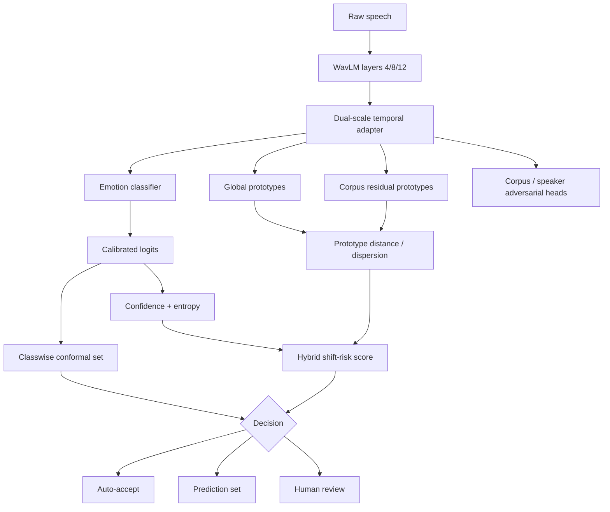

# AffectBridge-UQ / DIMAP-C v2 Architecture

## Processing path

1. **Audio preprocessing** — 16-kHz resampling, silence trimming, maximum 8-second duration.
2. **Frozen WavLM feature extraction** — hidden layers 4, 8 and 12 are extracted in one forward pass and summarized by segment-level mean and standard deviation.
3. **Dual-scale temporal adapter** — a trainable 192-dimensional adapter combines short- and longer-range temporal convolutions with a lightweight Transformer encoder and attention pooling.
4. **Hierarchical prototypes** — each known emotion receives a global prototype plus bounded corpus-specific residual prototypes.
5. **Progressive nuisance regularization** — corpus and speaker adversarial objectives are introduced progressively rather than at full strength from epoch 1.
6. **Cross-corpus structure learning** — same-emotion cross-corpus mixup and class-conditional alignment encourage domain-generalized embeddings.
7. **Calibration and uncertainty** — temperature scaling, classwise conformal sets and a hybrid shift-risk score provide selective output behavior.
8. **Decision policy** — confident singleton predictions can be auto-accepted; ambiguous/high-risk cases are deferred.

## Mermaid view

