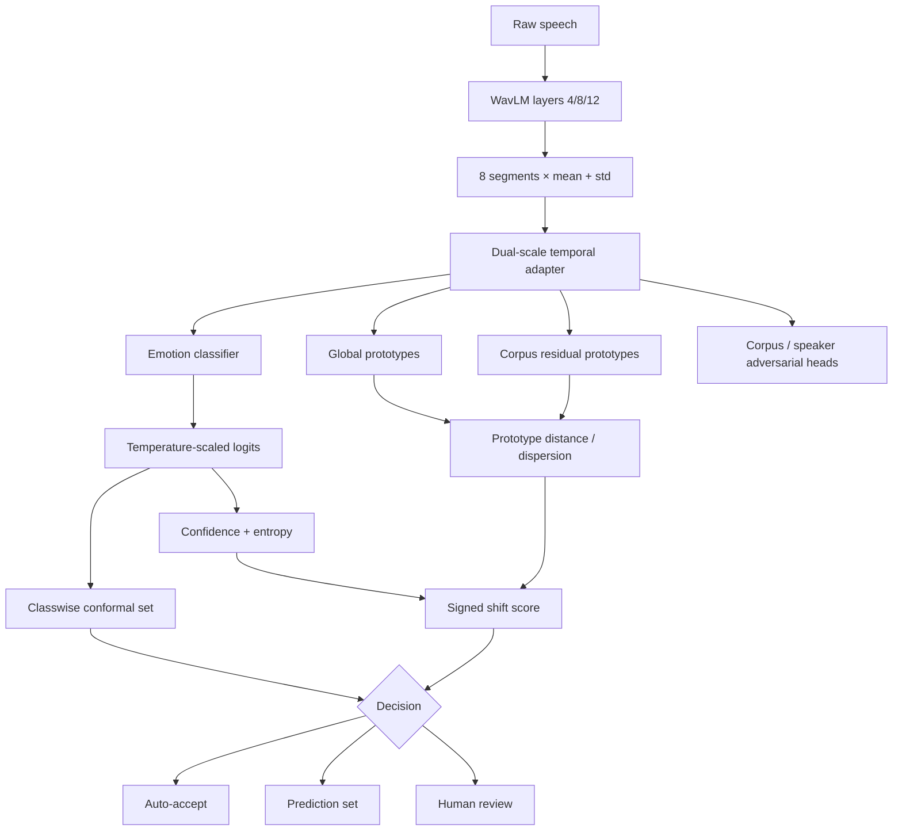

# AffectBridge-UQ / DIMAP-C v2 Architecture

## Processing path

1. **Audio preprocessing** — 16-kHz resampling, silence trimming at 35 dB, maximum 8-second duration.
2. **Frozen WavLM feature extraction** — hidden layers 4, 8 and 12 are extracted in one forward pass. Each selected layer is divided into eight temporal segments; segment-wise mean and standard deviation of the 768-dimensional hidden state are retained. Concatenating three layers gives a 4,608-dimensional descriptor per segment.
3. **Dual-scale temporal adapter** — a trainable 192-dimensional adapter combines depthwise 1D convolutions with kernel sizes 3 and 7, a learned sigmoid gate, a two-layer Transformer encoder, and attention pooling.
4. **Hierarchical prototypes** — each known emotion has one global prototype plus bounded corpus-specific residual prototypes.
5. **Progressive nuisance regularization** — corpus and speaker adversarial objectives are introduced progressively rather than at full strength from epoch 1.
6. **Cross-corpus structure learning** — same-emotion cross-corpus mixup, supervised contrastive learning, and class-conditional centroid alignment encourage source-domain transfer.
7. **Calibration and uncertainty** — temperature scaling, classwise conformal sets and a signed hybrid shift score provide selective output behavior.
8. **Decision policy** — confident singleton predictions can be auto-accepted; ambiguous or high-shift cases are deferred.

## Why WavLM layers 4, 8 and 12?

Layers 4, 8 and 12 were selected as lower-, middle-, and higher-level snapshots of the WavLM encoder hierarchy. This is an engineering design choice intended to retain complementary representations. No dedicated layer-selection ablation was performed, so the combination should not be interpreted as an empirically established optimum.

## Dual-scale adapter

Let `x_t` denote the 192-dimensional projected feature at temporal segment `t`. The adapter forms

`h_t = x_t + g_t ⊙ Conv3(x)_t + (1-g_t) ⊙ Conv7(x)_t`,

where `g_t ∈ [0,1]^192` is a learned sigmoid gate and `Conv3`, `Conv7` are depthwise 1D convolutions. The gated sequence is processed by a two-layer Transformer encoder. Attention pooling produces

`z = LN(Σ_t a_t Transformer(h)_t)`,

with softmax weights `a_t` satisfying `Σ_t a_t = 1`.

## Hierarchical prototypes

For emotion class `c`, the model learns a global prototype `p_c ∈ R^192`. For source corpus `d`, a residual vector `r_{d,c} ∈ R^192` yields

`p_{d,c} = p_c + ρ tanh(r_{d,c}),  ρ = 0.35`.

The bounded residual allows limited corpus-specific variation while keeping all source corpora tied to a shared emotion geometry. This differs from local prototype SER methods that primarily model intra-utterance variation: AffectBridge-UQ explicitly decomposes each emotion prototype into a shared global component and a corpus-specific residual while jointly applying cross-corpus regularization.

Prototype evidence is blended as

`ℓ_c = ℓ_cls,c + α(t) w_p g(z) [0.55 s_global,c + 0.45 s_local,c]`,

where `w_p=0.16`, `α(t)` is the progressive prototype schedule, and `g(z)=0.25+0.75·sigmoid(h(z))` is the learned prototype gate. The `0.55/0.45` global/local split is a fixed engineering hyperparameter held constant across folds and seeds; no sensitivity analysis is claimed.

## Progressive adversarial regularization

The gradient-reversal coefficient is

`λ_GRL(p) = λ_max [2/(1+exp(-8p)) - 1]`, with `λ_max=0.15`.

The actual loss coefficients are distinct from the GRL magnitude: corpus-adversarial cross-entropy enters the total loss with weight `0.04`, and speaker-adversarial cross-entropy with weight `0.015`.

## Training objective

The implemented objective is

`L = L_CE + 0.056 L_proto + 0.08 L_align + 0.04 L_cons + 0.08 L_supcon + 0.05 L_centroid + 0.04 L_domain + 0.015 L_speaker + 0.18 L_mix + 0.025 L_pseudo-OOD`.

The prototype-classification coefficient `0.056` equals `0.35 × 0.16`, matching the implementation. These coefficients are fixed implementation hyperparameters rather than learned quantities; global optimality is not claimed.

## Source-only feature-space augmentation

### Same-emotion cross-corpus mixup

For an eligible example `i`, sample `j` such that `y_j=y_i` and `corpus_j != corpus_i`. Approximately 50% of eligible pairs are retained. Draw `λ ~ Beta(0.6,0.6)`, rescale it to `[0.2,0.8]`, and form

`x_mix = λ x_i + (1-λ) x_j`.

The class label is unchanged and the mixed sample contributes `0.18 × cross-entropy`.

### Boundary pseudo-OOD mixup

Sample `j` such that `y_j != y_i` and `corpus_j != corpus_i`. Approximately 50% of eligible pairs are retained. Draw `λ ~ Beta(4,4)`, rescale it to `[0.3,0.7]`, and form

`x_ood = λ x_i + (1-λ) x_j`.

No class label is assigned. The pseudo-OOD sample contributes `0.025 × KL(p(.|x_ood) || Uniform)`. Ordinary supervised losses remain active on the original batch, so the model is not trained toward uniform predictions on in-distribution samples.

## Source-only calibration and conformal prediction

A scalar temperature `T` is fitted on source-validation logits by minimizing negative log-likelihood. For class `c`, nonconformity scores are `a_i=1-p_T(c|x_i)` for samples with `y_i=c`. With `n_c` class-specific scores and `α=0.10`, the implementation uses

`τ_c = min{1, ceil((n_c+1)(1-α))/n_c}`

and `q_c = Q_higher(τ_c)`, i.e. NumPy's `higher` empirical quantile convention. The target prediction set is

`Γ(x) = {c : p_T(c|x) >= 1-q_c}`.

Classical finite-sample validity requires exchangeability. Under held-out corpus shift, target coverage is therefore reported empirically rather than claimed as guaranteed.

## Signed hybrid shift score

The four components are:

- `r1 = 1 - max_c p_T(c|x)`;
- `r2 = normalized entropy`;
- `r3 = distance to the nearest global prototype`;
- `r4 = cross-corpus prototype dispersion`.

Each is standardized using source-validation median `m_j` and robust MAD scale `s_j`:

`R(x) = Σ_j w_j (r_j(x)-m_j)/s_j`, with `w=(1.00, 0.55, 0.85, 0.20)`.

These weights are fixed source-side design coefficients held constant across all folds and seeds; no target-specific tuning or sensitivity analysis is claimed. **Negative `R(x)` values are permitted and are not clipped or transformed.** The score is used only through its ordering relative to the source-derived threshold.

With source corpora used as calibration groups, the implemented threshold is

`τ_R = max_d Q_0.98({R_i : corpus_i=d})`.

A sample is auto-accepted only when its conformal set is a singleton and `R(x) <= τ_R`. Empty sets are reported as unknown; multi-class sets or scores above the threshold are routed to human review.

## Mermaid view

